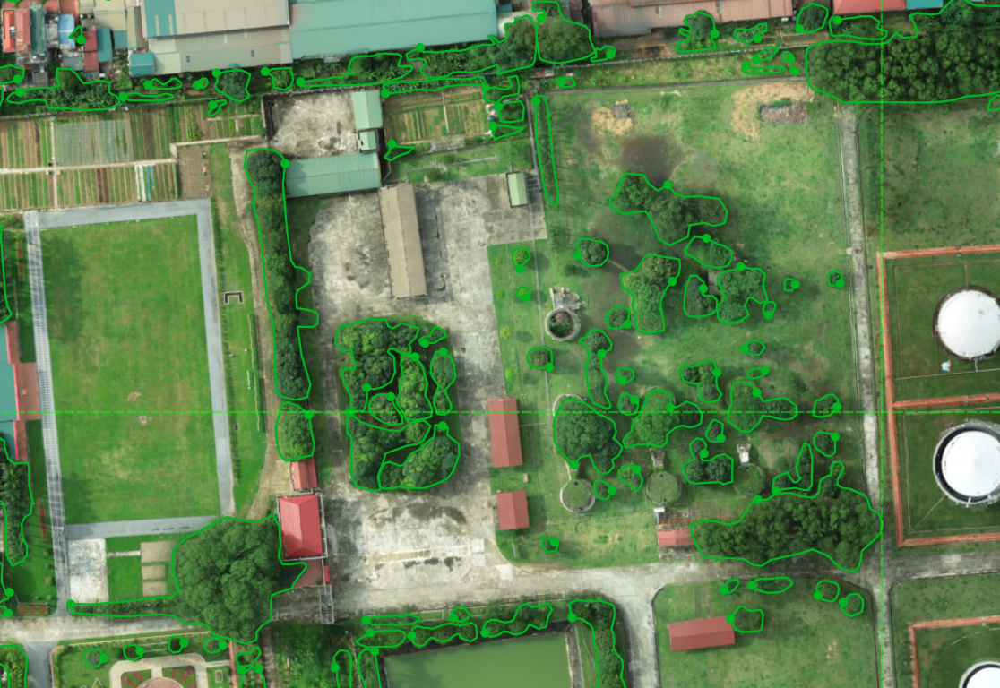
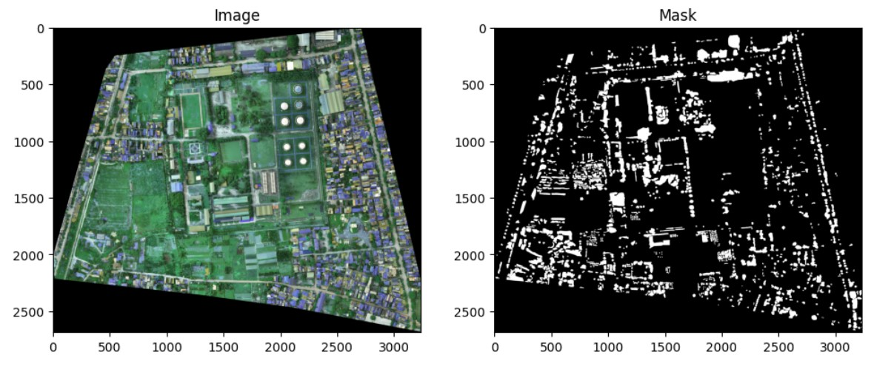
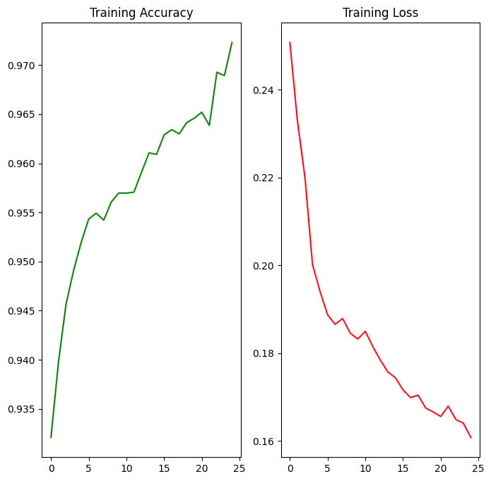
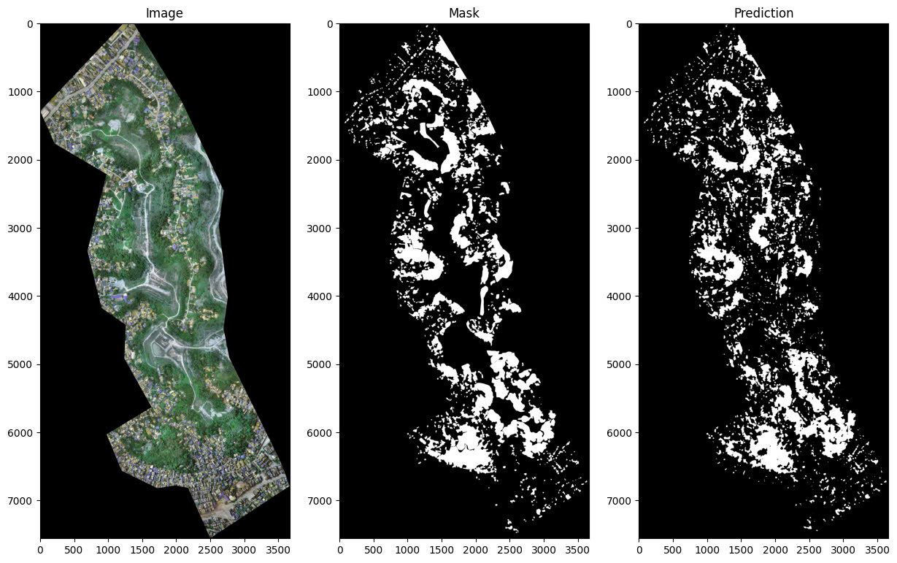

# Deep Learning-Based Image Segmentation for Drone-Captured Images
This project focuses on segmenting trees in drone-captured RGB images using deep learning. The UNet model, a widely used architecture for image segmentation, was trained on a custom dataset. I annotated the images with the AnyLabeling tool, generating segmentation masks from JSON outputs to create the training data for the model.

Draw bouding-boxes around the objects in AnyLabeling

# Dataset
The dataset consists of drone-captured images from various regions in Vietnam. Since the images vary in size and the model requires uniform input dimensions, I cropped each image and its corresponding mask into smaller patches of 256x256 pixels. The dataset was then split into training and testing sets, with the training set containing 4,044 patches and the testing set containing 1,737 patches

Original image and its mask.

# Training
The UNet model was trained on Google Colab. Due to the large size of the dataset, I limited the training to 25 epochs.

Training accuracy and loss of UNet model

# Result
After training and evaluating the model's performance using the testing set, the UNet achieved an accuracy of 89.47% and a loss of 0.63. Additionally, I computed the IOU index, which demonstrated a high IOU value for the testing images.

One testing image recorded a particularly high IOU index of 88.43%.

For more detailed information about this project, please refer to the [project-report](project_report.pdf) file.